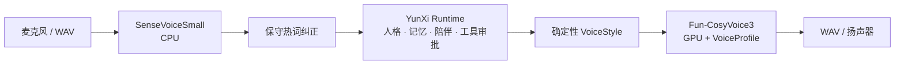

# YunXi Voice Runtime

YunXi Agent 的私有本地语音 sidecar。它只负责语音识别与语音合成，不负责对话、人格、记忆、工具调用或审批。

- 主仓库：[sjxbbdb/YunXi-Agent](https://github.com/sjxbbdb/YunXi-Agent)
- 语音仓库：[sjxbbdb/YunXi-Voice-Runtime](https://github.com/sjxbbdb/YunXi-Voice-Runtime)（Private）
- 默认地址：`http://127.0.0.1:17862`
- API Schema：`1`

## 单链架构

当前运行时只加载两个模型：

| 端 | 模型 | 设备 | 作用 |
| --- | --- | --- | --- |
| STT | `SenseVoiceSmall` | CPU | 快速中文识别、ITN、显式热词与拼音模糊纠正 |
| TTS | `Fun-CosyVoice3-0.5B-2512` | `cuda:0` | VoiceProfile 音色克隆、情绪指令、模型内分块合成 |

`faster-whisper large-v3`、`IndexTTS2`、`CosyVoice-300M-SFT` 和 quality worker 不再属于当前链路，也不会由安装器下载或加载。旧文件可以留在本机磁盘用于回滚，但不会占用显存。



识别临时结果不会触发 Agent、记忆或工具。只有最终转写进入 YunXi Runtime；成功回复完成后才进行语音合成。语音失败保留文字结果，不会重跑 Agent turn，也不会加载第二套模型。

## 仓库边界

| 仓库 | 职责 |
| --- | --- |
| `YunXi-Agent` | Rust CLI/TUI、麦克风、VAD、播放、对话、人格、记忆、陪伴、工具与审批 |
| `YunXi-Voice-Runtime` | Python sidecar、模型安装、VoiceProfile、识别、热词纠正和语音合成 |

依赖方向是 `YunXi-Agent -> loopback HTTP -> YunXi-Voice-Runtime`。两个仓库没有 Git submodule、Python import 或共享源码依赖。

## 源码内容

- `runtime_server.py`：单链 HTTP sidecar
- `voice_style.py`：确定性情绪选择与 CosyVoice3 指令
- `voice_profile.py` / `voice-profile.example.json`：本机音色配置契约
- `install-voice-runtime.ps1`：Python、依赖、CosyVoice 源码和模型安装
- `start-voice-runtime.ps1`：真实或 mock 服务启动
- `test_*.py`：不加载真实模型的回归测试
- `smoke_mock.py`：与 YunXi CLI 的进程级 mock 联调

模型、虚拟环境、参考音频、生成 WAV、缓存和日志只进入运行目录，不进入 Git。

## 环境要求

- Windows 10/11 x64
- NVIDIA GPU 与兼容驱动
- PowerShell 5.1 或 PowerShell 7
- Git、[uv](https://docs.astral.sh/uv/)
- 建议至少 `30GB` 可用磁盘空间
- 已安装或已构建的 `yunxi.exe`

已验证环境：RTX 5060 Ti 16GB、Python 3.10、PyTorch `2.8.0+cu129`、SenseVoiceSmall、Fun-CosyVoice3-0.5B-2512。

## 安装

```powershell
winget install -e --id astral-sh.uv
Set-ExecutionPolicy -Scope Process Bypass
Set-Location "D:\YunXi Voice Runtime Source"
.\install-voice-runtime.ps1 -RuntimeRoot "D:\YunXi Voice Runtime"
```

安装器写入：

| 目录 | 内容 |
| --- | --- |
| `venv/` | 单一 Python 3.10 环境 |
| `models/SenseVoiceSmall/` | `iic/SenseVoiceSmall` |
| `models/Fun-CosyVoice3-0.5B-2512/` | `FunAudioLLM/Fun-CosyVoice3-0.5B-2512` |
| `sources/CosyVoice/` | CosyVoice 与 Matcha-TTS 源码 |
| `profiles/` | 本机 VoiceProfile 与参考音频 |
| `cache/`、`logs/` | 下载缓存与脱敏诊断日志 |

旧参数 `-IncludeQuality` 和 `-SkipQualityModels` 仍会被 PowerShell 接受，但只输出弃用提示，不再安装额外模型。

## VoiceProfile

从模板建立本机 profile：

```powershell
$profileRoot = "D:\YunXi Voice Runtime\profiles\yunxi-primary"
New-Item -ItemType Directory -Force "$profileRoot\references" | Out-Null
Copy-Item .\voice-profile.example.json "$profileRoot\profile.json"
```

`profile.json` 的 `backend` 必须为 `cosyvoice3`。`reference_audio` 必须是用户拥有或已授权的清晰单人语音；`reference_transcript` 必须逐字匹配参考音频。profile、音频、逐字稿和生成结果不得提交 Git。

## 启动

```powershell
.\start-voice-runtime.ps1 -RuntimeRoot "D:\YunXi Voice Runtime" -Mode single `
  -VoiceProfile "D:\YunXi Voice Runtime\profiles\yunxi-primary\profile.json"
```

未显式传入 `-VoiceProfile` 时，启动器会尝试默认路径。旧的 `stable`、`quality`、`auto` 模式只作为兼容参数接受，并统一映射到 `single`；不会启动 quality worker。

```powershell
Invoke-RestMethod http://127.0.0.1:17862/health
yunxi voice doctor --json
```

健康信息应包含：

- `mode: single`
- `stt.model: SenseVoiceSmall`、`stt.device: cpu`
- `tts.model: Fun-CosyVoice3-0.5B-2512`、`tts.device: cuda:0`
- `voice_clone: true`、`emotion_control: true`

## 热词与模糊纠正

通过环境变量提供已经确认的称呼、项目名和专有词：

```powershell
$env:YUNXI_VOICE_HOTWORDS = "蓝色回声,YunXi Agent,项目代号"
$env:YUNXI_VOICE_HOTWORD_THRESHOLD = "0.95"
```

模糊纠正使用拼音和字符串近似匹配。默认阈值偏保守，避免吞掉助词或把普通同音词强行替换。云熙品牌名使用独立的上下文规则，不进行无条件全局替换。

## 情绪指令

HTTP 请求可以显式提供 `emotion`；未提供时，`voice_style.py` 从回复文本确定性选择：

- `gentle`
- `happy`
- `concerned`
- `serious`
- `sad`
- `surprised`
- `angry`（克制、坚定、不攻击）

情绪判断不会增加模型调用。CosyVoice3 使用同一个 VoiceProfile 参考音色执行 `inference_instruct2`。

## HTTP v1

| 方法 | 路径 | 输入 | 输出 |
| --- | --- | --- | --- |
| `GET` | `/health` | 无 | schema v1 健康 JSON |
| `POST` | `/v1/transcribe` | `audio/wav` | 最终转写 JSON |
| `POST` | `/v1/synthesize` | `{text, voice, format:"wav", emotion?, realtime?}` | `audio/wav` |

CosyVoice3 在 `realtime: true` 时使用模型内分块推理，但 HTTP v1 仍在完成后返回一个 WAV。当前能力不能描述为服务端流式播放或全双工通话；未来真正的首包播放应新增协议 v2。

## 测试

```powershell
python -m unittest discover -s . -p "test_*.py" -v
.\start-voice-runtime.ps1 -RuntimeRoot "D:\YunXi Voice Runtime" -Mock
python .\smoke_mock.py
```

真实验收至少覆盖：

- `yunxi voice doctor --json`
- 一次真实录音 `voice transcribe`
- 温柔与开心两种有效 WAV，且输出内容不同
- `voice speak`、`voice chat`、`voice devices`
- CLI/TUI 内两轮 `/voice` 与 `/voice realtime on`
- CPU STT、首次/热态 TTS 延迟和显存峰值
- 语音失败后保留文字回复且不重跑 Agent turn

## 安全边界

- 默认只监听回环地址。
- 麦克风音频保存在内存中；临时转写文件在请求结束后删除。
- 请求正文、转写文本和参考音频路径不写普通日志。
- VoiceProfile 的私密字段不出现在公开健康信息。
- 语音不能自动批准工具调用，也不会放宽现有审批策略。
