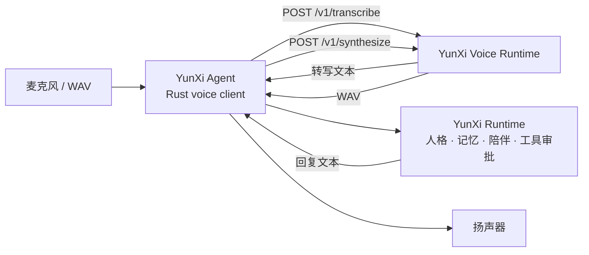

# YunXi Voice Runtime

YunXi Agent 的私有本地语音 sidecar。它负责语音识别与语音合成，不负责对话、人格、记忆、工具调用或审批。

- 主仓库：[sjxbbdb/YunXi-Agent](https://github.com/sjxbbdb/YunXi-Agent)
- 语音仓库：[sjxbbdb/YunXi-Voice-Runtime](https://github.com/sjxbbdb/YunXi-Voice-Runtime)（Private）
- 默认地址：`http://127.0.0.1:17862`
- API Schema：`1`

## 两个仓库的关系

| 仓库 | 职责 | 是否能独立完成对话 |
| --- | --- | --- |
| `YunXi-Agent` | Rust CLI/TUI、麦克风采集、VAD、扬声器播放、Provider、人格、记忆、陪伴、工具与审批 | 可以进行文字对话；语音功能需要 sidecar |
| `YunXi-Voice-Runtime` | Python 本地服务、SenseVoiceSmall STT、CosyVoice TTS、模型安装和健康检查 | 不可以，只提供语音输入输出能力 |

运行时依赖方向是 `YunXi-Agent -> HTTP -> YunXi-Voice-Runtime`。两者没有 Cargo、Python import、Git submodule 或共享数据目录依赖，只通过本机回环 HTTP 协议连接。



## 仓库包含与不包含的内容

本仓库只保存可审查、可复现的源码：

- `runtime_server.py`：回环 HTTP sidecar
- `install-voice-runtime.ps1`：Python、依赖、上游源码和模型安装器
- `start-voice-runtime.ps1`：真实或 mock 服务启动器
- `test_runtime_server.py`：纯 Python 单元测试
- `smoke_mock.py`：与已安装 YunXi CLI 的进程级 mock 联调

以下内容体积大、包含第三方产物或属于本机状态，因此永远不进入 Git：

- `SenseVoiceSmall` 和 `CosyVoice-300M-SFT` 模型权重
- Python 运行时、虚拟环境与 `site-packages`
- Hugging Face、ModelScope 和 uv 缓存
- CosyVoice、Matcha-TTS 的下载副本
- WAV、日志、转写内容、令牌和任何用户数据

## 环境要求

- Windows 10/11 x64
- NVIDIA GPU 与兼容驱动
- PowerShell 5.1 或 PowerShell 7
- Git
- [uv](https://docs.astral.sh/uv/)
- 建议至少 `30 GB` 可用磁盘空间
- 已安装或已构建的 `yunxi.exe`

已验证组合为 Python 3.10、PyTorch `2.8.0+cu129`、SenseVoiceSmall 和 CosyVoice-300M-SFT。RTX 50 系显卡不要改回 CosyVoice 旧文档中的 Torch 2.3.1 固定版本。

## 会下载什么

安装脚本会把所有运行产物写入 `-RuntimeRoot`，默认是 `D:\YunXi Voice Runtime`：

| 目录 | 下载内容 |
| --- | --- |
| `python/` | uv 管理的 Python 3.10 |
| `venv/` | PyTorch、FunASR、CosyVoice 所需 Python 包 |
| `models/SenseVoiceSmall/` | `iic/SenseVoiceSmall` 模型 |
| `models/CosyVoice-300M-SFT/` | `iic/CosyVoice-300M-SFT` 模型 |
| `sources/CosyVoice/` | FunAudioLLM/CosyVoice 源码 |
| `sources/CosyVoice/third_party/Matcha-TTS/` | Matcha-TTS 源码 |
| `cache/` | uv、ModelScope 和 Hugging Face 缓存 |

## 本地部署

### 1. 获取两个仓库

主仓库是公开仓库；语音仓库是私有仓库，需要 GitHub 账户 `sjxbbdb` 或被授权的账户：

```powershell
git clone https://github.com/sjxbbdb/YunXi-Agent.git "D:\YunXi Agent"
gh repo clone sjxbbdb/YunXi-Voice-Runtime "D:\YunXi Voice Runtime Source"
```

### 2. 安装 uv

```powershell
winget install -e --id astral-sh.uv
uv --version
```

### 3. 安装 Python、依赖和模型

```powershell
Set-ExecutionPolicy -Scope Process Bypass
Set-Location "D:\YunXi Voice Runtime Source"
.\install-voice-runtime.ps1 -RuntimeRoot "D:\YunXi Voice Runtime"
```

安装器最后会验证 CUDA、PyTorch、torchaudio、FunASR 与 CosyVoice 是否能被真实加载。不要把源码 checkout 与 `RuntimeRoot` 指向同一个目录。

### 4. 启动 sidecar

```powershell
Set-Location "D:\YunXi Voice Runtime Source"
.\start-voice-runtime.ps1 -RuntimeRoot "D:\YunXi Voice Runtime"
```

服务只允许绑定 `127.0.0.1`、`localhost` 或 `::1`。另开一个终端验证：

```powershell
Invoke-RestMethod http://127.0.0.1:17862/health
yunxi voice doctor
yunxi voice devices
```

## 接入 YunXi Agent

默认配置无需额外环境变量。YunXi Agent 会连接 `http://127.0.0.1:17862`：

```powershell
yunxi voice doctor
yunxi voice transcribe --input .\question.wav
yunxi voice speak "你好，我是云熙。" --output .\reply.wav
yunxi voice chat --input .\question.wav --output .\reply.wav --companion
```

在 CLI/TUI 中：

```text
/voice status
/voice devices
/voice
/voice realtime on
/voice realtime off
```

需要自定义端口时，两端必须保持一致：

```powershell
# sidecar
.\start-voice-runtime.ps1 -RuntimeRoot "D:\YunXi Voice Runtime" -Port 17863

# YunXi Agent
$env:YUNXI_VOICE_RUNTIME_URL = "http://127.0.0.1:17863"
yunxi voice doctor
```

可选配置：

| 环境变量 | 作用 |
| --- | --- |
| `YUNXI_VOICE_RUNTIME_URL` | YunXi Agent 使用的统一 sidecar 地址 |
| `YUNXI_VOICE_STT_URL` | 单独覆盖 STT 地址 |
| `YUNXI_VOICE_TTS_URL` | 单独覆盖 TTS 地址 |
| `YUNXI_VOICE_DEVICE` | 默认 `cuda:0` |
| `YUNXI_VOICE_STT_MODEL_DIR` | SenseVoiceSmall 本地路径或模型 ID |
| `YUNXI_VOICE_TTS_MODEL_DIR` | CosyVoice 本地路径或模型 ID |
| `YUNXI_COSYVOICE_REPO` | CosyVoice 源码目录 |
| `YUNXI_VOICE_AUTH_TOKEN` | 可选本地 Bearer Token；两端值必须相同 |
| `YUNXI_VOICE_ALLOW_REMOTE` | 设为 `1` 才允许 Rust 客户端连接非回环地址 |

## HTTP 协议

| 方法 | 路径 | 输入 | 输出 |
| --- | --- | --- | --- |
| `GET` | `/health` | 无 | JSON 健康状态与 `schema_version` |
| `POST` | `/v1/transcribe` | `audio/wav` 请求体 | JSON 转写结果 |
| `POST` | `/v1/synthesize` | `{text, voice, format:"wav"}` | `audio/wav` |

主仓库中的 `yunxi-agent-voice` 会校验 schema、输入输出大小、URL 范围和可选 Bearer Token。协议变更必须先保持两个仓库兼容，再分别发布。

## 测试

不安装模型即可运行：

```powershell
python -m unittest -v .\test_runtime_server.py
.\start-voice-runtime.ps1 -RuntimeRoot "D:\YunXi Voice Runtime" -Mock
```

当 `yunxi.exe` 已在 PATH 中时，可以执行完整 mock 联调：

```powershell
python .\smoke_mock.py
```

也可以明确指定 YunXi 可执行文件：

```powershell
$env:YUNXI_EXE = "D:\Apps\YunXi Agent\bin\yunxi.exe"
python .\smoke_mock.py
```

真实验收至少包括 `yunxi voice doctor`、一次 STT、一次 TTS、一次 `voice chat`，以及 CLI/TUI 中两轮连续语音对话。

## 安全边界

- 默认仅监听回环地址，不作为网络服务部署。
- 麦克风音频由 YunXi Agent 保存在内存中；sidecar 转写临时文件在请求结束后删除。
- 请求体和转写文本不写日志。
- 不要把 Token 写入仓库、README、脚本或截图。
- 语音不会自动批准工具调用，所有审批仍由 YunXi Agent 控制。
- 当前实时模式是半双工，不包含流式 STT、服务端流式 TTS、语音插话或音色克隆。
